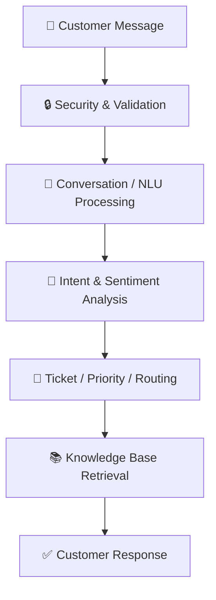
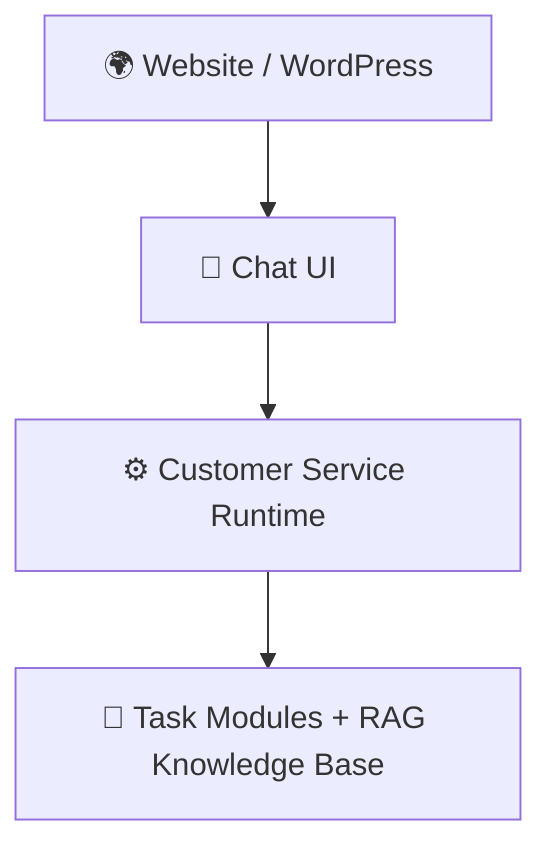

<div align="center">

# 🤖 Customer Service AI Chatbot

**A modular, RAG-powered customer service assistant built with Python and Streamlit.**


[Overview](#-overview) •
[Features](#-key-features) •
[Structure](#-project-structure) •
[Installation](#-installation) •
[Usage](#-running-the-application) •
[Troubleshooting](#-troubleshooting)

</div>

---

## 📖 Overview

This project combines a **task-based customer service workflow** with a **Retrieval-Augmented Generation (RAG) knowledge base** to deliver accurate, structured responses.

Every customer message passes through a unified runtime that integrates security, natural-language processing, intent handling, ticket management, priority processing, routing, and knowledge-base retrieval. The application is delivered through a **Streamlit** interface, while the runtime layer connects the individual task modules.



---

## ✨ Key Features

| Category | Capabilities |
|---|---|
| **Interface** | Interactive customer service chat built with Streamlit |
| **Knowledge** | RAG-based retrieval from a CSV knowledge source |
| **Architecture** | Modular, task-based design with a unified runtime |
| **Conversation** | Conversation and session handling |
| **Security** | Input security validation |
| **Understanding** | Natural-language and intent processing |
| **Analysis** | Sentiment and risk detection |
| **Operations** | Ticket and priority management, routing and escalation support |
| **Maintenance** | Knowledge-base version management |
| **Observability** | Runtime logging and monitoring |

---

## 🗂 Project Structure

```text
Customer_Service_Chatbot/
│
├── app.py                  # Streamlit chatbot interface
├── main.py
├── runtime.py              # Main integration layer
├── langchain llm.py
├── requirements.txt
│
├── dataset/
│   └── dataset.csv         # Customer-service knowledge source
│
├── runtime_data/           # Generated knowledge-base & runtime data
│
├── task 1/
├── task 2/
├── task 3/
├── task 4/
├── task 5/
└── task 6/                 # Individual processing modules
```

### Core Components

| Component | Description |
|---|---|
| `app.py` | Provides the Streamlit-based chatbot interface. |
| `runtime.py` | Main integration layer connecting the chat interface with the task modules and knowledge-base workflow. |
| `dataset/dataset.csv` | Customer-service knowledge used by the retrieval system. |
| `task 1` – `task 6` | Processing modules responsible for the different customer-service functions. |
| `runtime_data/` | Generated knowledge-base and runtime information. |

---

## 📊 Dataset Integration

The chatbot uses **`dataset/dataset.csv`** as its knowledge source. The runtime processes the dataset through the knowledge-base pipeline and makes the resulting information available to the retrieval system.

> 💡 **Tip:** When the dataset is updated, refresh the knowledge base so new or modified customer-service information becomes available to the chatbot.

---

## ⚙️ Installation

### Requirements

- Python **3.10+**
- VS Code or another Python IDE
- `pip`
- Internet connection for installing dependencies and any configured external AI services

### Setup

**1. Create a virtual environment**

```bash
python -m venv venv
```

**2. Activate it**

```bash
# Windows
venv\Scripts\activate

# macOS / Linux
source venv/bin/activate
```

**3. Install dependencies**

```bash
pip install -r requirements.txt
```

---

## 🚀 Running the Application

Start the Streamlit app from the project root:

```bash
streamlit run app.py
```

Then open the local URL shown in the terminal, typically:

👉 **http://localhost:8501**

Use the chat interface to submit customer questions and evaluate the generated responses.

---

## 🔄 System Workflow

1. A customer submits a message through the Streamlit interface.
2. The runtime validates and processes the message.
3. Relevant customer-service modules analyze the message.
4. Intent, sentiment, priority, and routing information are determined where applicable.
5. The knowledge-base retrieval component searches the available customer-service information.
6. The relevant information is returned to the response layer.
7. The chatbot presents the response to the customer.

This architecture keeps individual responsibilities separated while allowing them to operate as one customer-service system.

---

## 📚 Knowledge Base

The knowledge-base component manages the information used by the chatbot to answer customers.

- **Versioning:** updates can be managed without directly modifying the existing task modules.
- **Storage:** generated knowledge-base information is maintained under `runtime_data/`.

---

## 🛠 Troubleshooting

<details>
<summary><b>Dependencies are missing</b></summary>

Activate the project virtual environment and run:

```bash
pip install -r requirements.txt
```

</details>

<details>
<summary><b>Dataset is not being used</b></summary>

Verify that the dataset exists at `dataset/dataset.csv`, then restart the application and check the terminal output for runtime or ingestion errors.

</details>

<details>
<summary><b>Streamlit does not start</b></summary>

Make sure the command is run from the project root and that the virtual environment is active.

</details>

<details>
<summary><b>Chatbot does not return the expected knowledge</b></summary>

Verify that the knowledge-base process has completed successfully and that the latest dataset information is available to the active knowledge base.

</details>

---

## 🧰 Technology Stack

| Component | Technology |
|---|---|
| Language | Python |
| Frontend | Streamlit |
| RAG Framework | LangChain |
| Vector Search | FAISS |
| Embeddings | Sentence Transformers |
| Knowledge Source | CSV |
| Development Environment | VS Code |

---

## 🌐 Future Integration

The chatbot runtime is structured so it can be connected to other interfaces, including a **website or WordPress-based chat interface**.



This lets the existing customer-service logic be reused while changing only the frontend or deployment environment.

---

## ✅ Conclusion

The Customer Service AI Chatbot provides a modular framework for handling customer interactions by combining task-based processing with knowledge-base retrieval. The clear separation between the user interface, runtime, task modules, and knowledge base makes the system easy to maintain and extend for future web or WordPress integration.
